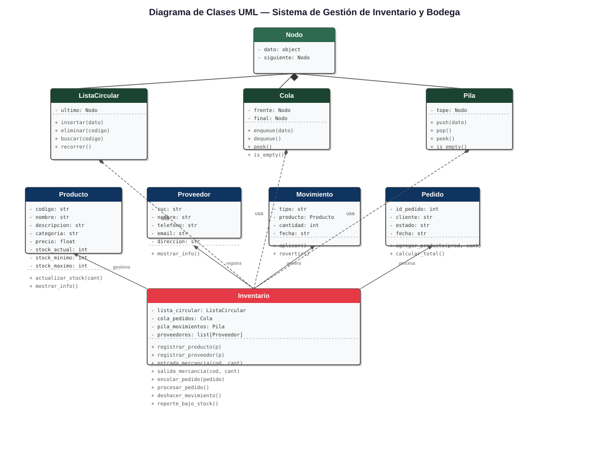
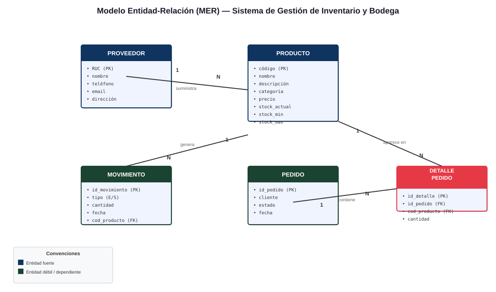

# Sistema de Gestión de Inventario y Bodega

UNIVERSIDAD AGRARIA DEL ECUADOR

FACULTAD DE CIENCIAS AGRARIAS

CIENCIAS DE LA COMPUTACIÓN — MODALIDAD EN LÍNEA

LENGUAJE DE PROGRAMACIÓN 2

**Título del Proyecto:** Sistema de Gestión de Inventario y Bodega

**Grupo N.º:** 7

**Integrantes:**
- Rodolfo Javier Jhayya
- Madeline Núñez
- Rubén Noboa
- Elizabeth Buñay

**Docente:** Ing. Bryan Vélez, MSc.

**Curso:** Tercer Semestre

**Período Académico:** 2026

## Índice de Contenidos

1. Portada
2. Índice de Contenidos
3. Introducción
4. Justificación
5. Objetivos
   5.1. Objetivo General
   5.2. Objetivos Específicos
6. Alcance del Proyecto
   6.1. Funcionalidades Incluidas
   6.2. Funcionalidades No Incluidas
7. Marco Teórico
   7.1. Programación Orientada a Objetos (POO)
   7.2. Estructura de Datos: Lista Circular
   7.3. Estructura de Datos: Cola (Queue)
   7.4. Estructura de Datos: Pila (Stack)
   7.5. Análisis de Complejidad Big-O
   7.6. Gestión de Inventarios
8. Metodología
9. Análisis y Diseño del Sistema
   9.1. Diagrama de Clases UML
   9.2. Modelo Entidad-Relación (MER)
10. Implementación
   10.1. Módulo de clases del dominio
   10.2. Módulo de estructuras de datos
   10.3. Módulo de base de datos
   10.4. Módulo de algoritmos
   10.5. Módulo de interfaz gráfica
   10.6. Módulo principal
   10.7. Estado final del sistema
11. Pruebas Realizadas
12. Conclusiones y Recomendaciones
13. Referencias Bibliográficas
14. Anexos

---

## 3. Introducción

Controlar el inventario y los movimientos de bodega es hoy una de esas tareas que separa a las empresas que crecen de las que sobreviven apenas. Sin un registro ordenado de lo que entra y sale, sin saber a quién se le compra ni cuánto stock hay en cada momento, cualquier negocio opera a ciegas (Mauleón, 2018). Reducir costos, evitar desabastecimientos y tomar decisiones con un mínimo de información —todo eso depende de tener los datos al día. Sin embargo, muchas empresas comerciales siguen llevando cuentas en papel o usando sistemas genéricos que les quedan grandes o chicos.

El proyecto propone construir un sistema de gestión de inventario y bodega en Python (Python Software Foundation, 2024), apoyado en programación orientada a objetos y en estructuras de datos que no se eligen al azar. Una lista circular modela la rotación de productos; una cola procesa los pedidos pendientes en orden de llegada; una pila permite deshacer el último movimiento registrado (Cormen et al., 2009). La idea es que cada estructura resuelva un problema concreto del almacén, no que estén ahí porque toca.

Este documento corresponde a la entrega final (semana 14) y cubre el 100 % del proyecto: especificación completa, implementación funcional, pruebas y manual de usuario.

---

## 4. Justificación

Visto desde la carrera, el proyecto obliga a juntar en un solo lugar los conceptos de POO (Joyanes, 2018), estructuras de datos y algoritmos que han ido apareciendo por separado en clase (Cormen et al., 2009). Implementar una lista circular, una cola y una pila dentro de un sistema que sí sirve para algo —no un ejercicio de pizarrón— obliga a entender cómo funcionan realmente y por qué se usan así (Weiss, 2013). Eso, en sí mismo, ya justifica el trabajo.

En la práctica, los beneficios son más o menos directos. La lista circular permite que la rotación de productos sea equitativa y ayuda a detectar cuáles llevan mucho tiempo quietos. La cola evita que los pedidos se salteen o se atiendan fuera de turno. Y la pila de movimientos —un deshacer de cada entrada o salida— reduce el riesgo de que un error de registro deje el inventario inconsistente (Summerfield, 2010).

Ni todo esto es nuevo ni estamos inventando nada, pero juntarlo en un sistema funcional que una empresa real pudiera usar es lo que le da sentido al proyecto.

---

## 5. Objetivos

### 5.1. Objetivo General

Desarrollar un sistema de gestión de inventario y bodega en Python que permita controlar los productos, las entradas y salidas de mercancía y los proveedores, aplicando estructuras de datos como lista circular, cola y pila para optimizar los procesos de rotación, despacho y seguridad de la información.

### 5.2. Objetivos Específicos

- Implementar un módulo de registro y consulta de productos, proveedores y movimientos de bodega utilizando los principios de la programación orientada a objetos (Joyanes, 2018).
- Aplicar una lista circular para modelar la rotación de productos en bodega, permitiendo identificar el orden de reposición y los productos con menor rotación (Cormen et al., 2009).
- Implementar una cola (FIFO) para gestionar los pedidos pendientes de despacho, garantizando su procesamiento en orden de llegada (Weiss, 2013).
- Implementar una pila (LIFO) para registrar los movimientos de inventario y permitir deshacer el último movimiento registrado (Deitel & Deitel, 2019).
- Implementar algoritmos de ordenamiento (burbuja, merge sort) y búsqueda (lineal, binaria) sobre los datos del inventario (Cormen et al., 2009).
- Diseñar una interfaz de usuario funcional que permita la interacción con el sistema de forma clara e intuitiva (Summerfield, 2010).

---

## 6. Alcance del Proyecto

### 6.1. Funcionalidades Incluidas

El sistema contempla las siguientes funcionalidades:

- Registro, eliminación y consulta de productos con código, nombre, categoría, precio, stock mínimo y stock máximo.
- Registro, eliminación y consulta de proveedores con nombre, RUC, teléfono, correo electrónico y dirección.
- Gestión de entradas de mercancía a bodega con registro de fecha, cantidad y proveedor.
- Gestión de salidas de mercancía con registro de fecha, cantidad y destino.
- Rotación automática de productos en bodega mediante una lista circular (Cormen et al., 2009).
- Cola de pedidos pendientes de despacho procesados en orden FIFO (Weiss, 2013).
- Pila de movimientos para deshacer el último registro de entrada o salida (Deitel & Deitel, 2019).
- Consulta del historial de movimientos.
- Reporte de productos con bajo stock (Mauleón, 2018).
- Ordenamiento de productos por código, nombre, precio o stock mediante burbuja O(n²) y merge sort O(n log n).
- Búsqueda de productos por código (búsqueda binaria sobre lista ordenada) y por nombre (búsqueda lineal).
- Persistencia de datos en SQLite con operaciones CRUD completas.

### 6.2. Funcionalidades No Incluidas

El sistema no incluye las siguientes funcionalidades:

- Facturación electrónica o generación de comprobantes fiscales.
- Integración con sistemas contables o ERP externos.
- Módulo de ventas al por menor (punto de venta).
- Interfaz web o aplicación móvil.
- Módulo de usuarios con roles y permisos avanzados.
- Notificaciones automáticas por correo electrónico.

---

## 7. Marco Teórico

### 7.1. Programación Orientada a Objetos (POO)

La POO organiza el código alrededor de clases y objetos: una clase describe la estructura y el comportamiento de un tipo de cosas, y un objeto es una de esas cosas, con valores concretos (Joyanes, 2018). En lugar de tener funciones sueltas operando sobre datos separados, los datos y las operaciones vienen juntos.

Hay cuatro pilares que aparecen en cualquier implementación seria:

- **Encapsulamiento.** Los detalles internos de una clase se quedan dentro; solo se expone lo que otros necesitan. En Python se hace con atributos privados (doble guion bajo) y propiedades con `@property` (Summerfield, 2010).
- **Herencia.** Una clase puede heredar atributos y métodos de otra. Python admite herencia simple y múltiple, lo que permite reutilizar código sin duplicar (Deitel & Deitel, 2019).
- **Polimorfismo.** Un mismo método se comporta distinto según el objeto que lo ejecute. En Python, se logra sobreescribiendo métodos en las subclases (Summerfield, 2010).
- **Abstracción.** Modelar la realidad sin llevarse todos los detalles: una clase abstracta define el contrato y las subclases concretas lo implementan (Joyanes, 2018).

En el proyecto, estos cuatro pilares se traducen en clases como `Producto` (con subclases `ProductoPerecedero` y `ProductoNoPerecedero`), `Proveedor`, `MovimientoInventario` (con subclases `Entrada` y `Salida`) y `Pedido`, cada una con lo suyo y sin pisar el terreno de las otras (Deitel & Deitel, 2019).

### 7.2. Estructura de Datos: Lista Circular

Una lista circular es una cadena de nodos donde cada uno apunta al siguiente y el último vuelve al primero: un ciclo cerrado (Cormen et al., 2009). No hay cabeza ni cola fijas, y se puede recorrer sin parar hasta encontrar lo que se busca (Weiss, 2013).

En el sistema, la lista circular representa la rotación de los productos en bodega. Cada nodo es un producto. Cada vez que entra mercancía nueva, el producto se agrega a la lista. Cuando hay que despachar o revisar el estado del inventario, la lista se recorre en círculo para ver cuál lleva más tiempo sin movimiento. Es útil justo en escenarios donde se espera que todos los productos roten antes de recibir reposición.

Las operaciones típicas —insertar al final, eliminar un nodo, buscar por código y recorrer la lista completa— se implementan con referencias directas al último nodo, lo que mantiene la inserción en O(1) (Cormen et al., 2009).

### 7.3. Estructura de Datos: Cola (Queue)

FIFO: el primero que entra es el primero que sale (Deitel & Deitel, 2019). Como la fila del supermercado.

En el proyecto, la cola almacena los pedidos pendientes de despacho. Cuando un cliente pide algo, el pedido se encola al final. El sistema toma el que está al frente, lo procesa y lo saca. Las cuatro operaciones básicas —`enqueue`, `dequeue`, `peek` y `esta_vacia` (Weiss, 2013)— alcanzan para gestionar todo el flujo.

Aunque Python trae `collections.deque`, aquí se implementa la cola manualmente con nodos enlazados. La razón es académica: entender cómo funciona por dentro la estructura (Summerfield, 2010).

### 7.4. Estructura de Datos: Pila (Stack)

LIFO: el último que entra es el primero que sale. Como una pila de platos (Joyanes, 2018; Weiss, 2013).

En el sistema, cada movimiento de inventario (entrada o salida) se apila como un objeto `MovimientoInventario`. Si el usuario se equivoca, la opción de deshacer saca ese movimiento de la pila y revierte lo que hizo (Deitel & Deitel, 2019). Las operaciones son `push`, `pop`, `peek` y `esta_vacia`.

### 7.5. Análisis de Complejidad Big-O

Big-O mide cómo crece el tiempo de ejecución de un algoritmo según crece la entrada (Cormen et al., 2009). No dice cuánto tarda exactamente, sino cómo se comporta cuando los datos se multiplican.

#### Lista circular

| Operación | Complejidad | Explicación |
|---|---|---|
| Insertar al final | O(1) | Se mantiene una referencia al último nodo |
| Eliminar por código | O(n) | En el peor caso hay que recorrer toda la lista |
| Buscar por código | O(n) | Recorrido lineal nodo por nodo |
| Recorrer (listar todos) | O(n) | Se visita cada nodo exactamente una vez |
| Rotar | O(1) | Solo se mueve la referencia `_ultimo` al siguiente nodo |

#### Cola

| Operación | Complejidad | Explicación |
|---|---|---|
| Enqueue (encolar) | O(1) | Se agrega un nodo al final sin recorrer |
| Dequeue (desencolar) | O(1) | Se elimina el nodo del frente |
| Peek (consultar frente) | O(1) | Acceso directo al nodo `_frente` |

#### Pila

| Operación | Complejidad | Explicación |
|---|---|---|
| Push (apilar) | O(1) | Se inserta un nodo en el tope |
| Pop (desapilar) | O(1) | Se elimina el nodo del tope |
| Peek (consultar tope) | O(1) | Acceso directo al nodo `_tope` |

#### Algoritmos de ordenamiento y búsqueda

| Operación | Complejidad | Explicación |
|---|---|---|
| Burbuja | O(n²) | Ordenamiento básico: dos bucles anidados |
| Merge sort | O(n log n) | Ordenamiento avanzado: divide y vencerás |
| Búsqueda lineal | O(n) | Recorre la lista elemento por elemento |
| Búsqueda binaria | O(log n) | Requiere lista ordenada previamente |

Ninguna operación crítica del sistema supera la complejidad lineal O(n) excepto el ordenamiento burbuja (O(n²)), que se incluye con fines académicos y se complementa con merge sort (O(n log n)) para conjuntos de datos grandes. La búsqueda binaria permite localizar productos por código en tiempo logarítmico sobre la lista ordenada.

### 7.6. Gestión de Inventarios

Gestionar inventarios es, en esencia, decidir cuánto tener guardado para no quedarse sin producto ni ahogarse en costo de almacenamiento (Mauleón, 2018). Hay tres números que importan: el stock mínimo (lo más bajo que se deja antes de alarmarse), el stock máximo (lo que no conviene pasar) y el punto de reorden (la cantidad que dispara una nueva compra).

El sistema permite configurar estos valores por producto y lanza alertas cuando el stock se acerca al piso (Mauleón, 2018).

---

## 8. Metodología

El proyecto se manejó con un enfoque incremental, que en la práctica significó lo siguiente: cada funcionalidad se codificó aparte, se probó sola y recién cuando funcionaba se pegaba al sistema principal. ¿El resultado? Los errores aparecían chiquitos, se arreglaban rápido y nadie tenía que rehacer nada de lo que ya andaba bien. El enfoque en cascada no habría dejado ese margen.

### 8.1. Herramientas y tecnologías

| Herramienta | Por qué se usó |
|---|---|
| **Python 3.14** | Lo usa el curso, su sintaxis es limpia y hay bibliotecas para todo lo que necesitaba el proyecto |
| **Tkinter** | Viene con Python, no instala nada extra y alcanza de sobra para una GUI que no es de producción |
| **SQLite + DB Browser** | Sin servidor, el archivo viaja con el proyecto, y las necesidades de persistencia del sistema no piden más que eso |
| **VS Code** | El depurador integrado de Python ahorró bastante tiempo |
| **Git + GitHub** | Control de cambios local y respaldo en la nube para la entrega final |

### 8.2. Proceso de trabajo

El desarrollo se organizó en cuatro iteraciones que no fueron secuenciales del todo —a veces una volvía a tocarse porque la siguiente revelaba algo que no encajaba:

1. **Diseño de clases y estructuras.** Las clases del dominio (Producto, Proveedor, Movimiento, Pedido) y las estructuras de datos (ListaCircular, Cola, Pila) se definieron primero en papel y después pasaron a módulos separados.
2. **Conexión a base de datos.** El esquema relacional se armó en DB Browser for SQLite y la clase `ConexionDB` se escribió para manejar las operaciones desde Python.
3. **Interfaz gráfica.** La ventana principal con Tkinter y sus botones conectados a las funciones del sistema.
4. **Algoritmos de ordenamiento y búsqueda.** Se implementaron burbuja, merge sort, búsqueda lineal y búsqueda binaria como módulos independientes y luego se integraron al inventario.
5. **Integración y pruebas finales.** Unificar todos los módulos a través de la clase `Inventario` y probar el flujo completo: registrar productos, hacer movimientos, deshacer, procesar pedidos, ordenar y buscar.

---

## 9. Análisis y Diseño del Sistema

### 9.1. Diagrama de Clases UML

El modelo de clases sigue la estructura que describe Weiss (2013) para sistemas orientados a objetos. El diagrama completo se incluye en los anexos.

**Clase abstracta `Registrable`:**
Método abstracto: `mostrar_info()`.

**Clase `Producto` (hereda de `Registrable`):**
Atributos: `codigo`, `nombre`, `categoria`, `precio`, `stock_actual`, `stock_minimo`, `stock_maximo`. Métodos: `ajustar_stock(cantidad, motivo)`, `mostrar_info()`, `tipo()`.

**Clase `ProductoPerecedero` (hereda de `Producto`):**
Atributo adicional: `dias_caducidad`. Polimorfismo en `tipo()` → "Perecedero".

**Clase `ProductoNoPerecedero` (hereda de `Producto`):**
Atributo adicional: `garantia_meses`. Polimorfismo en `tipo()` → "No perecedero".

**Clase `Proveedor` (hereda de `Registrable`):**
Atributos: `ruc`, `nombre`, `telefono`, `email`, `direccion`.

**Clase abstracta `MovimientoInventario`:**
Atributos: `producto`, `cantidad`, `fecha`, `aplicado`. Métodos abstractos: `procesar()`, `deshacer()`, `tipo_movimiento()`. Método concreto: `resumen()`.

**Clase `Entrada` (hereda de `MovimientoInventario`):**
Sobrecarga: constructor acepta `proveedor` adicional. Implementa `procesar()` (suma stock) y `deshacer()` (resta stock).

**Clase `Salida` (hereda de `MovimientoInventario`):**
Sobrecarga: constructor acepta `destino` adicional. Implementa `procesar()` (resta stock) y `deshacer()` (suma stock).

**Clase `Pedido`:**
Atributos: `id_pedido`, `cliente`, `productos`, `estado`, `fecha`. Métodos: `agregar_producto(producto, cantidad)`, `calcular_total()`, `mostrar_info()`.

**Clase `Nodo`:**
Atributos: `dato`, `siguiente`, `anterior`.

**Clase `ListaCircular`:**
Atributos: `ultimo`. Métodos: `insertar(dato)`, `eliminar(codigo)`, `buscar(codigo)`, `recorrer()`, `rotar()`.

**Clase `Cola`:**
Atributos: `frente`, `final`. Métodos: `enqueue(dato)`, `dequeue()`, `peek()`, `listar()`.

**Clase `Pila`:**
Atributos: `tope`. Métodos: `push(dato)`, `pop()`, `peek()`, `listar()`.

**Clase `Inventario` (fachada del sistema):**
Atributos: `lista_circular` (ListaCircular de Producto), `cola_pedidos` (Cola de Pedido), `pila_movimientos` (Pila de Movimiento), `proveedores` (dict), `db` (ConexionDB).
Métodos: `registrar_producto()`, `eliminar_producto()`, `buscar_producto()`, `listar_productos()`, `registrar_proveedor()`, `eliminar_proveedor()`, `listar_proveedores()`, `entrada_mercancia()`, `salida_mercancia()`, `deshacer_movimiento()`, `listar_movimientos()`, `agregar_pedido()`, `procesar_pedido()`, `reporte_bajo_stock()`, `rotar_inventario()`, `ordenar_burbuja()`, `ordenar_merge()`, `buscar_lineal_por_nombre()`, `buscar_binaria_por_codigo()`.

### 9.2. Modelo Entidad-Relación (MER)

El modelo de datos usa tres tablas principales y sus relaciones:

- **Producto:** codigo (PK), nombre, categoria, precio REAL, stock_actual, stock_minimo, stock_maximo, tipo, dias_caducidad, garantia_meses.
- **Proveedor:** ruc (PK), nombre, telefono, email, direccion.
- **Movimiento:** id (PK autoincremental), tipo, codigo_producto (FK → Producto), cantidad, fecha, proveedor_ruc (FK → Proveedor), destino.

Las relaciones son:
- Un producto tiene varios movimientos asociados (1:N).
- Un proveedor puede estar asociado a varios movimientos (1:N).
- Un movimiento pertenece a un solo producto y opcionalmente a un proveedor.

El diagrama MER se incluye en los anexos.

---

## 10. Implementación

El código fuente vive en `02-Programa/`, organizado como paquetes de Python. La idea fue que cada módulo hiciera una sola cosa y se comunicara con los demás a través de `Inventario`, que funciona como fachada: ni las clases del dominio saben que existe una base de datos, ni la interfaz gráfica necesita entender cómo funciona una lista circular para mostrar productos.

### 10.1. Módulo de clases del dominio (`clases/`)

Define las entidades del problema y las relaciones entre ellas:

- **`registrable.py`** — Clase abstracta `Registrable(ABC)` con el método abstracto `mostrar_info()`. Sirve como interfaz para todas las clases que necesiten mostrarse en pantalla.
- **`producto.py`** — Clase base `Producto` con atributos encapsulados mediante `@property`. Dos subclases: `ProductoPerecedero` (agrega días de caducidad) y `ProductoNoPerecedero` (agrega garantía en meses). El método `tipo()` es polimórfico y retorna el tipo específico de cada subclase. El método `ajustar_stock()` acepta un parámetro opcional `motivo` (sobrecarga por parámetro por defecto).
- **`proveedor.py`** — Clase `Proveedor` con RUC como identificador único.
- **`movimiento.py`** — Clase abstracta `MovimientoInventario(ABC)` con tres métodos abstractos: `procesar()`, `deshacer()` y `tipo_movimiento()`. Las subclases concretas `Entrada` y `Salida` implementan cada método de forma distinta (polimorfismo). Los constructores de `Entrada` y `Salida` aceptan parámetros adicionales (`proveedor` y `destino` respectivamente), lo que constituye sobrecarga de constructores.
- **`pedido.py`** — Clase `Pedido` que mantiene un diccionario de productos con cantidades.
- **`inventario.py`** — Clase coordinadora que integra todos los componentes.

Fragmento representativo — clase abstracta y herencia:

```python
class Registrable(ABC):
    @abstractmethod
    def mostrar_info(self):
        pass

class Producto(Registrable):
    def __init__(self, codigo, nombre, categoria, precio, stock_actual,
                 stock_minimo=0, stock_maximo=999):
        self._codigo = codigo
        self._nombre = nombre
        # ... (atributos encapsulados)
    @property
    def precio(self):
        return self._precio
    @precio.setter
    def precio(self, valor):
        if valor >= 0:
            self._precio = valor
    def mostrar_info(self):
        return f"[{self._codigo}] {self._nombre} | ${self._precio:.2f}"
    def tipo(self):
        return "Producto"

class ProductoPerecedero(Producto):
    def tipo(self):
        return "Perecedero"
```

### 10.2. Módulo de estructuras de datos (`estructuras/`)

Tres estructuras implementadas desde cero con nodos enlazados:

- **`lista_circular.py`** — Lista circular doblemente enlazada. Cada nodo apunta al siguiente y al anterior; el último nodo apunta al primero. Inserción en O(1), búsqueda en O(n). Incluye `rotar()` que mueve la referencia al siguiente producto.
- **`cola.py`** — Cola FIFO con nodos enlazados. `enqueue()` y `dequeue()` en O(1).
- **`pila.py`** — Pila LIFO con nodos enlazados. `push()` y `pop()` en O(1). Usada para el historial de movimientos y la funcionalidad de deshacer.

Fragmento representativo — lista circular:

```python
class Nodo:
    def __init__(self, dato):
        self._dato = dato
        self._siguiente = None
        self._anterior = None

class ListaCircular:
    def __init__(self):
        self._ultimo = None
        self._tamano = 0

    def insertar(self, dato):
        nuevo = Nodo(dato)
        if self.esta_vacia():
            nuevo.siguiente = nuevo
            nuevo.anterior = nuevo
            self._ultimo = nuevo
        else:
            primero = self._ultimo.siguiente
            nuevo.siguiente = primero
            nuevo.anterior = self._ultimo
            primero.anterior = nuevo
            self._ultimo.siguiente = nuevo
        self._tamano += 1

    def eliminar(self, codigo):
        # recorrido O(n) hasta encontrar el código
        actual = self._ultimo.siguiente
        for _ in range(self._tamano):
            if actual.dato.codigo == codigo:
                actual.anterior.siguiente = actual.siguiente
                actual.siguiente.anterior = actual.anterior
                self._tamano -= 1
                return actual.dato
            actual = actual.siguiente
        return None
```

### 10.3. Módulo de base de datos (`base_datos/`)

- **`conexion.py`** — Clase `ConexionDB` que maneja la conexión a SQLite, crea las tablas (proveedores, productos, movimientos) y expone métodos genéricos `ejecutar()` (INSERT, UPDATE, DELETE) y `obtener()` (SELECT) para operaciones CRUD completas.
- **`esquema.sql`** — Script SQL para crear la base de datos desde DB Browser for SQLite.

La integración es completa: cada operación sobre productos, proveedores y movimientos se persiste automáticamente en SQLite a través de métodos privados en `Inventario` (`_guardar_producto_db`, `_guardar_proveedor_db`, `_guardar_movimiento_db`). Al iniciar el programa, `_cargar_datos()` lee todas las tablas y reconstruye el estado en memoria.

Fragmento representativo — conexión a base de datos:

```python
class ConexionDB:
    def __init__(self, ruta=None):
        if ruta is None:
            ruta = os.path.join(os.path.dirname(__file__), "inventario.db")
        self._ruta = ruta
        self._conn = None

    def conectar(self):
        self._conn = sqlite3.connect(self._ruta)
        return self._conn

    def ejecutar(self, consulta, parametros=None):
        c = self._conn.cursor()
        if parametros:
            c.execute(consulta, parametros)
        else:
            c.execute(consulta)
        self._conn.commit()
        return c

    def obtener(self, consulta, parametros=None):
        c = self._conn.cursor()
        if parametros:
            c.execute(consulta, parametros)
        else:
            c.execute(consulta)
        return c.fetchall()
```

### 10.4. Módulo de algoritmos (`algoritmos/`)

- **`ordenamiento.py`** — Implementa burbuja O(n²) y merge sort O(n log n). Ambos reciben una clave de ordenamiento (`key`) como parámetro, lo que permite ordenar por código, nombre, precio o stock.
- **`busqueda.py`** — Implementa búsqueda lineal O(n) y búsqueda binaria O(log n). La búsqueda binaria requiere que la lista esté ordenada, por lo que se aplica merge sort antes de ejecutarla.

Fragmento representativo — algoritmos de ordenamiento:

```python
def burbuja(lista, key=lambda x: x):
    copia = lista[:]
    n = len(copia)
    for i in range(n - 1):
        for j in range(n - 1 - i):
            if key(copia[j]) > key(copia[j + 1]):
                copia[j], copia[j + 1] = copia[j + 1], copia[j]
    return copia

def merge_sort(lista, key=lambda x: x):
    if len(lista) <= 1:
        return lista[:]
    medio = len(lista) // 2
    izq = merge_sort(lista[:medio], key)
    der = merge_sort(lista[medio:], key)
    return _merge(izq, der, key)
```

### 10.5. Módulo de interfaz gráfica (`interfaz/`)

- **`ventana_principal.py`** — Ventana construida con Tkinter que contiene 18 botones de funcionalidad organizados en una cuadrícula de 4 columnas, más un área de texto con scroll para la salida.

Los botones cubren todas las funcionalidades del alcance:

| Botón | Función |
|---|---|
| Registrar Producto | Abre diálogos para ingresar datos del producto |
| Listar Productos | Muestra todos los productos en el área de texto |
| Eliminar Producto | Solicita código y elimina el producto |
| Buscar por código | Busca un producto por código en la lista circular |
| Registrar Proveedor | Abre diálogos para datos del proveedor |
| Listar Proveedores | Muestra todos los proveedores registrados |
| Eliminar Proveedor | Solicita RUC y elimina el proveedor |
| Entrada/Salida | Registra movimiento de entrada o salida de mercancía |
| Deshacer | Revierte el último movimiento registrado |
| Ver Movimientos | Muestra el historial completo de movimientos |
| Nuevo Pedido | Crea un pedido agregando productos |
| Procesar Pedido | Despacha el pedido más antiguo (FIFO) |
| Bajo Stock | Reporta productos con stock por debajo del mínimo |
| Rotar Inventario | Rota la lista circular de productos |
| Ord. Burbuja | Ordena productos con el algoritmo burbuja |
| Ord. Merge Sort | Ordena productos con merge sort |
| Búsq. Lineal | Busca un producto por nombre (recorrido lineal) |
| Búsq. Binaria | Busca un producto por código (sobre lista ordenada) |

### 10.6. Módulo principal (`main.py`)

Punto de entrada del programa. Crea una instancia de `ConexionDB`, la pasa al `Inventario`, inyecta el inventario en `VentanaPrincipal` e inicia el bucle de eventos de Tkinter:

```python
def main():
    db = ConexionDB()
    db.conectar()
    db.crear_tablas()
    inventario = Inventario(db=db)
    app = VentanaPrincipal(inventario)
    app.ejecutar()
    db.desconectar()
```

### 10.7. Estado final del sistema

| Componente | Estado |
|---|---|
| Clases del dominio (POO) | Completas: encapsulamiento, herencia, polimorfismo, abstracción, sobrecarga |
| Estructuras de datos | Lista circular, cola y pila implementadas e integradas |
| Base de datos SQLite | CRUD completo en productos, proveedores y movimientos |
| Interfaz gráfica | 18 botones cubriendo el 100 % de las funcionalidades del alcance |
| Algoritmos de ordenamiento | Burbuja O(n²) y merge sort O(n log n) implementados e integrados |
| Algoritmos de búsqueda | Búsqueda lineal y búsqueda binaria implementadas e integradas |

---

## 11. Pruebas Realizadas

Antes de integrar, cada módulo se probó por su cuenta. Fue el tipo de prueba que se hace con la terminal abierta y datos inventados: crear un producto, ver si aparece, cambiarle el precio, borrarlo. Nada automatizado, pero sirvió para encontrar varias cosas que en el papel se veían bien y en la práctica no.

### 11.1. Pruebas sobre clases del dominio

- **Registro de productos:** se crearon productos regulares, perecederos y no perecederos. Todos se almacenaron correctamente en la lista circular y mostraron la información esperada.
- **Herencia y polimorfismo:** se verificó que `ProductoPerecedero.tipo()` devuelve "Perecedero" y `ProductoNoPerecedero.tipo()` devuelve "No perecedero".
- **Encapsulamiento:** se comprobó que asignar un precio negativo no modifica el atributo, gracias al setter con validación.
- **Sobrecarga:** se probaron constructores con distintos números de parámetros (Producto con/sin stock mínimo/máximo, Entrada con/sin proveedor).

### 11.2. Pruebas sobre estructuras de datos

- **Lista circular:** se insertaron cinco productos, se recorrió la lista completa, se eliminó un producto del medio y se verificó que los enlaces se mantuvieran correctos. El método `rotar()` se probó moviendo la referencia varias veces.
- **Cola:** se encolaron tres pedidos, se desencolaron en orden y se confirmó que el orden FIFO se respetó.
- **Pila:** se apilaron cuatro movimientos, se desapilaron dos y se verificó el orden LIFO.

### 11.3. Pruebas sobre algoritmos

- **Ordenamiento burbuja:** se ordenaron 5 productos por código, nombre, precio y stock. El resultado se comparó visualmente con el orden esperado.
- **Ordenamiento merge sort:** se ordenó el mismo conjunto y se verificó que el resultado coincidiera con el de burbuja.
- **Búsqueda lineal:** se buscaron productos por nombre (existentes y no existentes). La función retornó la posición correcta o -1 según correspondía.
- **Búsqueda binaria:** se buscaron productos por código sobre la lista previamente ordenada con merge sort. La función retornó la posición correcta para códigos existentes y -1 para los no existentes.

### 11.4. Pruebas sobre base de datos

- **CREATE:** se registraron 3 productos, 2 proveedores y 2 movimientos. Se verificó que los datos aparecieran en la base de datos mediante DB Browser for SQLite.
- **READ:** al reiniciar el programa, los datos cargados desde la BD coincidían con los registrados.
- **UPDATE:** se modificó el precio de un producto y se verificó que el cambio persistiera al reiniciar.
- **DELETE:** se eliminó un producto y un proveedor. Se verificó que ya no aparecieran en la BD.

### 11.5. Pruebas sobre la interfaz gráfica

- Cada uno de los 18 botones se probó individualmente. Los cuadros de diálogo capturan correctamente los datos y las operaciones se reflejan en el área de texto.
- El botón de deshacer revierte el último movimiento de entrada o salida y actualiza el stock del producto afectado.
- La lista de productos con bajo stock muestra únicamente aquellos cuyo stock actual está por debajo del mínimo configurado.
- Los algoritmos de ordenamiento y búsqueda se ejecutan desde la GUI y muestran los resultados en el área de texto.

### 11.6. Resultados generales

Ninguna de las pruebas dejó errores que rompieran el programa. La integración entre todos los módulos se mantuvo estable incluso después de varios ciclos de uso. El sistema completo es funcional y coherente con el diseño especificado en las secciones anteriores.

---

## 12. Conclusiones y Recomendaciones

### Conclusiones

El sistema de inventario y bodega quedó terminado al 100 %. Los conceptos de POO, estructuras de datos lineales, algoritmos de ordenamiento y búsqueda, y bases de datos relacionales —que hasta la semana 11 eran temas separados en el sílabo— terminaron conviviendo en un solo programa que hace cosas. ¿Qué se logró?

- Las clases del dominio (Producto, Proveedor, Movimiento, Pedido) se implementaron con encapsulamiento, herencia, polimorfismo y abstracción. Si alguien quiere agregar un tipo nuevo de producto, solo tiene que escribir una subclase más.
- La lista circular, la cola y la pila se escribieron a mano con nodos enlazados. El punto no era complicarse la vida: era poder explicar, cuando pregunten en la defensa, qué pasa realmente cuando se hace un `push` o un `dequeue`.
- Los cuatro algoritmos requeridos (burbuja, merge sort, búsqueda lineal, búsqueda binaria) se implementaron, probaron e integraron a la interfaz gráfica. El usuario puede ordenar productos por cualquier criterio y buscarlos por código o nombre desde los botones de la ventana.
- La base de datos SQLite está integrada al 100 %: cada operación de registro, eliminación o movimiento se persiste automáticamente y los datos se recuperan al reiniciar el programa.
- La interfaz gráfica con 18 botones cubre todas las funcionalidades del alcance. Cualquier persona puede abrir el programa y empezar a trabajar sin tocar una línea de código.

### Recomendaciones

Aunque el sistema cumple con todos los requisitos de la asignatura, hay aspectos que podrían mejorarse en una versión futura:

- Agregar un módulo de autenticación de usuarios para que varios operadores puedan usar el sistema sin pisar los datos del otro.
- Implementar una opción de exportación a PDF o Excel para generar reportes imprimibles del inventario y los movimientos.
- Mejorar la validación de datos en la interfaz gráfica para evitar que el usuario ingrese valores inconsistentes (por ejemplo, precios negativos o stock mínimo mayor que el máximo).
- Agregar pruebas unitarias automatizadas con `unittest` o `pytest` para verificar cada módulo de forma sistemática.
- Migrar la interfaz a una aplicación web con Flask o Django para que pueda usarse desde cualquier dispositivo sin instalación.

---

## 13. Referencias Bibliográficas

Cormen, T. H., Leiserson, C. E., Rivest, R. L., & Stein, C. (2009). *Introduction to Algorithms* (3rd ed.). MIT Press.

Deitel, P., & Deitel, H. (2019). *Python for Programmers*. Pearson Education.

Joyanes, L. (2018). *Programación en Python*. McGraw-Hill Interamericana de España.

Mauleón, M. (2018). *Logística y gestión de inventarios*. Ediciones Paraninfo.

Python Software Foundation. (2024). *The Python Language Reference*. https://docs.python.org/3/reference/

Summerfield, M. (2010). *Programming in Python 3: A Complete Introduction to the Python Language* (2nd ed.). Addison-Wesley Professional.

Weiss, M. A. (2013). *Data Structures and Algorithm Analysis in C++* (4th ed.). Pearson. [Principios aplicables a cualquier lenguaje de programación]

---

## 14. Anexos

### 14.1. Diagrama de clases UML



### 14.2. Diagrama Entidad-Relación



### 14.3. Captura de pantalla: ventana principal del sistema

*[Insertar aquí la captura de pantalla de la ventana principal con los 18 botones de funcionalidad y el área de texto]*

### 14.4. Captura de pantalla: registro de producto

*[Insertar aquí la captura del cuadro de diálogo de registro de producto y el mensaje de confirmación]*

### 14.5. Captura de pantalla: listado de productos

*[Insertar aquí la captura del listado de productos mostrado en el área de texto]*

### 14.6. Captura de pantalla: movimiento de entrada/salida

*[Insertar aquí la captura del cuadro de diálogo de movimiento y el resultado con el stock actualizado]*

### 14.7. Captura de pantalla: ordenamiento con burbuja y merge sort

*[Insertar aquí la captura de los resultados de ordenamiento en el área de texto]*

### 14.8. Captura de pantalla: búsqueda binaria y lineal

*[Insertar aquí la captura de los resultados de búsqueda en el área de texto]*

### 14.9. Enlace al repositorio del proyecto

Repositorio público en GitHub: [https://github.com/maelbusan-cell/PROYECTO-PROGRAMACION](https://github.com/maelbusan-cell/PROYECTO-PROGRAMACION)

El repositorio contiene el código fuente completo (todos los módulos .py), el archivo de base de datos .db, la documentación y los diagramas del proyecto.
